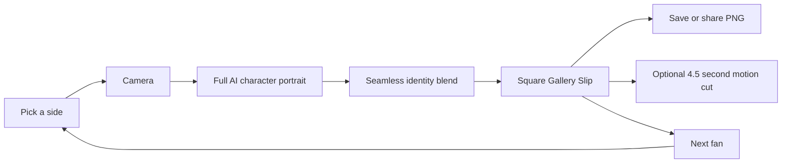

# Novig Booth

`novig: for the cup`

Novig Booth turns one camera photo into a square, shareable Gallery Slip. The fan chooses a World Cup or college-football side, takes one photo, and receives a funny AI-created character portrait with the frozen matchup, odds, chance, $50 amount, and return.

## Live app

- Production: [novig-photo-booth.vercel.app](https://novig-photo-booth.vercel.app)
- Editable design source: [Novig Booth in Figma](https://www.figma.com/design/eDIXIAqeGyY5KIDUGsb4Vw?node-id=5-2)

The public flow is intentionally short:

1. Pick a league, matchup, and side.
2. Take one photo.
3. Receive the finished AI portrait and square slip in seconds.
4. Save or share the still, optionally create a 4.5-second motion cut, or start the next fan.

There is no confirmation page, editable form, provider chooser, upload panel, QR code, or developer interface in the fan experience.

## Hosted AI portrait architecture

The production result does not depend on a local process, a provider key, or an unreliable third-party queue. Eighteen complete AI-generated character portraits are bundled with the application: eight World Cup quarterfinalists and both schools in every one of the five college-football openers. Every source portrait already has a complete face, body, costume, and scene.

At capture time, a bundled on-device face detector locates the fan's eyes, mouth, and face bounds without uploading the selfie. The compositor then blends only their identifying facial features into the full AI portrait and matches the generated scene's color and light. A face-shaped feather matte preserves the generated hair, jaw, costume, and background. There is no empty face opening, unchanged-photo fallback, or visible oval cutout.

This gives the booth a deterministic, fully hosted result even if an external image service is slow or unavailable:



`GET /api/generate` reports whether an optional server-side enhancement provider is configured. Its POST contract requires a job ID, rejects unchanged output, and has a 25-second timeout. The guaranteed booth path never waits for it.

## Complete starting slates

World Cup:

- France vs Morocco
- Spain vs Belgium
- Norway vs England
- Argentina vs Switzerland

College football:

- USC vs San José State
- Alabama vs East Carolina
- Georgia vs Tennessee State
- Florida vs Florida Atlantic
- LSU vs Clemson

All eighteen sides have distinct artwork and costume direction. Schedule state is derived from the current clock. World Cup scoreboard details can refresh from ESPN while the verified schedule and demo line remain available as a fallback.

## Run locally

Requirements:

- Node.js 20.9 or newer
- npm
- A browser with camera permission, or fixture mode

```bash
npm install
npm run dev
```

Open [http://127.0.0.1:3000](http://127.0.0.1:3000).

Useful URLs:

- `/` — World Cup booth
- `/?cfb=1` — college-football booth
- `/?fixture=1` — synthetic camera with the same public flow
- `/?fixture=1&cfb=1` — synthetic college-football flow

## Routes

| Route | Purpose |
| --- | --- |
| `GET /api/slate` | World Cup schedule/status snapshot with verified fallback data |
| `GET /api/slate?mode=cfb` | Five verified 2026 openers and ten selectable schools |
| `GET /api/generate` | Report optional hosted enhancement availability |
| `POST /api/generate` | Correlated, server-only optional enhancement request |
| `POST /api/codex-image-job` | Legacy local bridge retained for compatibility; not used by the hosted booth |

## Important files

- `app/page.tsx` — the four-state booth experience
- `app/globals.css` — responsive visual system and team animation
- `lib/slate.ts` — schedule, odds, and matchup data
- `lib/prompts.ts` — all country and school visual themes
- `lib/face-blend.ts` — face-aware AI identity and lighting compositor
- `lib/instant-portrait.ts` — compatibility facade for the full-AI renderer
- `lib/composite.ts` — square Gallery Slip canvas renderer
- `lib/motion.ts` — optional square WebM/MP4 export
- `public/templates/ai/` — eighteen complete AI-generated character portraits
- `public/mediapipe/` — self-hosted face detector runtime and model

## Verification

```bash
npm run lint
npm run build
npm audit --omit=dev
```

`?fixture=1` covers the complete camera-to-AI-portrait-to-still-to-motion path without a physical webcam. The production deployment is also tested directly after release.

## Approved brand copy

Use only these taglines in visible or generated output:

- `novig: just sports`
- `novig: winners welcome`
- `novig: for the cup`
