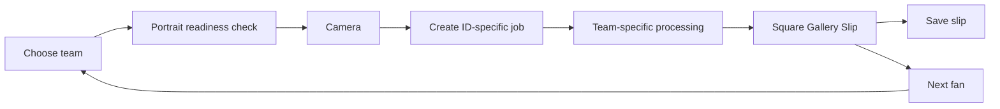

# Novig Booth

`novig: for the cup`

Novig Booth is a local-first Codex Mini-App that turns one camera photo into one square, shareable Gallery Slip. The fan chooses a World Cup country or college-football team, takes a photo, and receives a framed portrait with the frozen matchup, odds, chance, $50 amount, and return.

The public flow stays deliberately small:

1. Choose a booth and team.
2. Take one photo.
3. Wait on a full-screen team-specific animation.
4. Save the finished square slip or reset for the next fan.

There is no confirmation page, editable form, provider chooser, upload panel, QR code, or developer interface in the fan experience.

## What is in this repository

- A Next.js App Router booth optimized for a tablet, laptop, or phone camera.
- World Cup quarterfinal and college-football opener slates.
- Team-specific portrait prompts and loading motion.
- A 1080 × 1080 museum-framed Gallery Slip renderer.
- An ID-specific local job handoff for Codex built-in Image Gen.
- Persistent local sessions so a refresh does not lose a captured fan.
- A synthetic-camera fixture for repeatable browser testing.
- A production architecture plan for replacing the local handoff with a hosted image API.
- A two-person arcade-style versus concept.

## Read the guides

- [Codex Mini-App operating guide](docs/CODEX_MINI_APP.md)
- [Hosted runtime and 20–30 second delivery plan](docs/HOSTED_RUNTIME_PLAN.md)
- [Two-person versus mode](docs/VERSUS_MODE.md)
- [Original build story](docs/how-it-was-built.html)

## Run locally

Requirements:

- Node.js 20.9 or newer
- npm
- Codex desktop for the credential-free local image-edit loop
- A browser with camera permission, or the synthetic fixture mode

Install and start:

```bash
npm install
npm run dev
```

Open [http://127.0.0.1:3000](http://127.0.0.1:3000).

Useful local URLs:

- `/` — World Cup booth
- `/?cfb=1` — college-football booth
- `/?fixture=1` — synthetic camera with the same public interface
- `/?fixture=1&cfb=1` — synthetic college-football flow
- `/?dev=1` — intentionally identical to the public booth

## How the Codex Mini-App works

The local booth does not place an image-provider credential in the website.

1. The browser validates and compresses the camera frame.
2. `POST /api/codex-image-job` writes a new immutable job under `.codex/booth-image-job/`.
3. The response includes a unique job ID and exact input, prompt, and output paths.
4. The active Codex task edits that job's input with built-in Image Gen.
5. Codex writes the result to that job's exact `resultPath`.
6. The browser polls `GET /api/codex-image-job?id=<jobId>`.
7. Only the matching result can finish that fan's session.
8. The generated portrait is rendered into the square Gallery Slip.

Each job keeps its own metadata and files. A late result from an older fan cannot complete a newer fan's slip.

See [docs/CODEX_MINI_APP.md](docs/CODEX_MINI_APP.md) for the complete job contract and the Codex operating loop.

## App state machine



## Routes

| Route | Purpose |
| --- | --- |
| `GET /api/slate` | World Cup schedule and market snapshot with verified fallback data |
| `GET /api/slate?mode=cfb` | Selected 2026 college-football openers and demo lines |
| `POST /api/codex-image-job` | Create a local, ID-specific Codex image job |
| `GET /api/codex-image-job?id=<id>` | Poll one local job and return its matching image when complete |
| `GET /api/codex-image-job?preflight=1&countryCode=<code>` | Confirm the local job workspace is ready before camera access |
| `POST /api/generate` | Optional provider adapter retained for hosted experiments |

The local Codex job route intentionally returns `409 local_only` when deployed on Vercel. The hosted replacement is specified in [docs/HOSTED_RUNTIME_PLAN.md](docs/HOSTED_RUNTIME_PLAN.md).

## Data and rendering boundaries

- Camera images are normalized in the browser to a maximum 1536-pixel side.
- Local job inputs, prompts, metadata, and results are ignored by Git.
- The active browser session is stored on that device so refreshes can recover.
- Live matchup values are frozen when the fan chooses a side.
- Card composition is deterministic Canvas code in `lib/composite.ts`.
- Portrait themes and image-edit prompts live in `lib/prompts.ts`.
- The fast USC contingency uses a pre-approved open-face Trojan armor plate in `public/templates/`.
- The final share artifact contains no QR code.

## Supported experiences

World Cup mode currently includes:

- France vs Morocco
- Spain vs Belgium
- Norway vs England
- Argentina vs Switzerland

College-football mode currently includes:

- USC vs San José State
- Alabama vs East Carolina
- Georgia vs Tennessee State
- Florida vs Florida Atlantic
- LSU vs Clemson

Schedule data is separate from portrait generation. The hosted version should configure one active matchup per physical booth so the fan flow can become simply **photo → processing → finished slip**, without requiring a game selection.

## Commands

```bash
npm run dev       # local development server
npm run lint      # TypeScript validation
npm run build     # production Next.js build
scripts/build-demo.sh  # rebuild the static docs/ demo
```

The static `docs/` export is a UI demo. Static hosting cannot run the local Codex job route or a protected hosted provider.

## Hosted production direction

The production plan keeps the interface but replaces filesystem handoff with:

- direct object-storage upload,
- an immutable session record,
- a server-only provider adapter,
- two warm generation lanes,
- webhook completion,
- deterministic square-slip composition,
- a hard 30-second product deadline,
- and measured launch gates for latency, quality, and failure recovery.

Higgsfield is a viable candidate because its official SDK supports server-only credentials, image references, polling, and webhooks. A strict maximum cannot be inferred from public API documentation alone; it must be proven by load testing and, for a true guarantee, backed by reserved capacity or a contracted provider SLA. The full decision and rollout plan is in [docs/HOSTED_RUNTIME_PLAN.md](docs/HOSTED_RUNTIME_PLAN.md).

## Approved brand copy

Use only these taglines in visible or generated output:

- `novig: just sports`
- `novig: winners welcome`
- `novig: for the cup`
