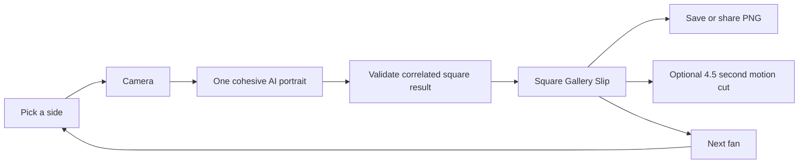

# Novig Booth

`novig: for the cup`

Novig Booth turns one camera photo into a square, shareable Gallery Slip. The fan chooses a World Cup or college-football side, takes one photo, and receives a funny AI-created character portrait with the frozen matchup, odds, chance, $50 amount, and return.

## Live app

- Production: [novig-photo-booth.vercel.app](https://novig-photo-booth.vercel.app)
- Editable design source: [Novig Booth in Figma](https://www.figma.com/design/eDIXIAqeGyY5KIDUGsb4Vw?node-id=5-2)

The public flow is intentionally short:

1. Pick a league, matchup, and side.
2. Take one photo.
3. Receive the finished AI portrait and square slip in seconds.
4. Save or share the still, optionally create a 4.5-second motion cut, or start the next fan.

There is no confirmation page, editable form, provider chooser, upload panel, QR code, or developer interface in the fan experience.

## Hosted AI portrait architecture

The finished portrait is a real image-to-image generation. Team artwork under `public/templates/ai/` is used only on the pick cards; it is never used as the result portrait. The app does not paste facial pixels into a pre-made head, mascot opening, or body.

Before mounting the camera, the booth asks `GET /api/generate` for a live readiness check. Readiness requires all three of these conditions:

- a configured Vercel AI Gateway or direct Gemini provider;
- a successful release canary for the exact deployed build, prompts, provider configuration, and image model in under 42 seconds; and
- a live credential and billing probe.

After capture, the browser normalizes one square photo and sends one correlated request containing a job ID, frozen selection key, and allowlisted team code. The server owns every prompt and asks the image model to re-render the face, hair, neck, body, costume, background, lighting, texture, and color grade as one unified photograph. It rejects unchanged, oversized, malformed, late, or mismatched output. There is no composited or original-photo fallback.

Once a generated result passes validation, the browser makes a short, bounded persistence attempt before showing the finished slip: only the generated image is kept in same-origin Cache Storage for 30 minutes, while small metadata in tab-scoped session storage correlates the job, mode, team, game, and frozen selection. A successful write makes the same finished slip refresh-restorable. If browser storage is unavailable, slow, or a write fails, the validated portrait still appears, but that instance is not refresh-restorable. The raw camera capture is never persisted.

Next Fan, a mode switch, or a new selection removes only the correlated cache entry referenced by that tab; it never clears the shared cache. Expired cache entries are explicitly purged while unrelated unexpired entries, including distinct results in other tabs, remain intact.



On Vercel, AI Gateway authentication uses the short-lived OIDC token attached to each Function request, so the app does not need a long-lived image API key. The Vercel team still needs billing verification before Gateway credits can be used. Production remains closed at the readiness screen until a real canary passes.

## Complete starting slates

World Cup:

- France vs Morocco
- Spain vs Belgium
- Norway vs England
- Argentina vs Switzerland

College football:

- USC vs San José State
- Alabama vs East Carolina
- Georgia vs Tennessee State
- Florida vs Florida Atlantic
- LSU vs Clemson

All eighteen sides have distinct artwork and costume direction. Schedule state is derived from the current clock. World Cup scoreboard details can refresh from ESPN while the verified schedule and demo line remain available as a fallback.

## Run locally

Requirements:

- Node.js 20.9 or newer
- npm
- A browser with camera permission, or fixture mode

```bash
npm install
npm run dev
```

Open [http://127.0.0.1:3000](http://127.0.0.1:3000).

Useful URLs:

- `/` — World Cup booth
- `/?cfb=1` — college-football booth
- `/?fixture=1` — synthetic camera with the same public flow
- `/?fixture=1&cfb=1` — synthetic college-football flow

## Routes

| Route | Purpose |
| --- | --- |
| `GET /api/slate` | World Cup schedule/status snapshot with verified fallback data |
| `GET /api/slate?mode=cfb` | Five verified 2026 openers and ten selectable schools |
| `GET /api/generate?teamCode=FRA` | Live image-provider and release-canary preflight |
| `POST /api/generate` | Correlated, server-owned cohesive portrait edit |
| `POST /api/codex-image-job` | Legacy local bridge retained for compatibility; not used by the hosted booth |

## Important files

- `app/page.tsx` — the four-state booth experience
- `app/globals.css` — responsive visual system and team animation
- `lib/slate.ts` — schedule, odds, and matchup data
- `lib/prompts.ts` — country and school display themes
- `lib/server/team-prompts.ts` — allowlisted server-owned cohesive edit prompts
- `lib/composite.ts` — square Gallery Slip canvas renderer
- `lib/motion.ts` — optional square WebM/MP4 export
- `public/templates/ai/` — eighteen pick-card previews only
- `scripts/assert-cohesive-flow.mjs` — structural regression gate preventing any compositor/template result path
- `scripts/run-image-canary.mjs` — protected synthetic-image release canary for a deployed provider

## Verification

```bash
npm run lint
npm run build
npm run check:cohesive
npm audit --omit=dev
```

`?fixture=1` supplies a synthetic camera frame but still uses the real hosted generation route. It can never substitute a preview or fake a finished result. A production release also requires real-camera visual checks for France, Belgium, Spain, and USC.

After a successful canary, the runner prints server-only values for the exact release artifact. Deployment automation records all of them, and the proof expires after seven days:

- `AI_IMAGE_PROVIDER_VERIFIED=1`
- `AI_IMAGE_PROVIDER_CANARY_MS=<measured elapsed time>`
- `AI_IMAGE_PROVIDER_VERIFIED_ARTIFACT_SHA256=<opaque artifact digest>`
- `AI_IMAGE_PROVIDER_VERIFIED_CONFIG_SHA256=<opaque provider, prompt, and validation digest>`
- `AI_IMAGE_PROVIDER_VERIFIED_AT=<server-issued epoch milliseconds>`
- `AI_IMAGE_PROVIDER_VERIFIED_EXPIRES_AT=<server-issued epoch milliseconds>`

The canary itself uses a server-owned synthetic image and the exact production prompt, provider, timeout, decoded-pixel checks, and correlation contract. It binds automatically to `VERCEL_GIT_COMMIT_SHA`; non-Git deployments must provide a deliberate `BOOTH_RELEASE_ARTIFACT_ID`:

```bash
BOOTH_CANARY_SECRET=... node scripts/run-image-canary.mjs \
  --url https://your-preview.vercel.app \
  --team USC \
  --model google/gemini-3.1-flash-image
```

## Approved brand copy

Use only these taglines in visible or generated output:

- `novig: just sports`
- `novig: winners welcome`
- `novig: for the cup`
