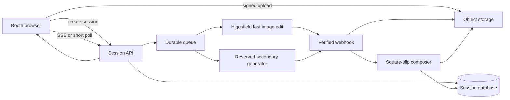

# Hosted runtime plan: photo to final slip in 20–30 seconds

## Objective

Host the booth on the web with the same functional shape as the Codex Mini-App while removing the local filesystem and active-agent dependency.

The production fan path should be only:

```text
Take photo → Processing → Finished square slip
```

The physical booth's event configuration determines the matchup, team look, copy, and slip values. The fan does not choose or edit a game during the capture flow.

Two product invariants drive the design:

1. The captured person is transformed by an image generator and that transformed portrait is used inside the final slip.
2. The final slip is visible within 30 seconds of the shutter action, with a 20–25 second operating target.

## Important reliability boundary

An absolute maximum cannot be guaranteed by application code sitting on top of a shared third-party generation API. Network failure, provider queueing, moderation, and regional outages remain outside the app's control.

To market a true every-capture guarantee, one of these must be true:

- Higgsfield or another provider gives Novig a contracted maximum-latency SLA with reserved capacity, or
- Novig operates dedicated, pre-warmed GPU inference with two healthy replicas and admission control.

Without one of those, the honest release target is an SLO such as 99.9% under 30 seconds, plus a deterministic contingency. Higgsfield's public enterprise page discusses guaranteed speed written into an agreement, but the exact bound must be negotiated and load-tested before launch: <https://higgsfield.ai/enterprise>.

## Recommended architecture



### Web application

- Next.js on Vercel, Cloudflare, or another edge-capable host.
- No provider credential in the browser.
- Camera capture and JPEG/WebP compression happen client-side.
- Direct signed upload avoids base64 request bodies and serverless body limits.
- The browser receives a session ID immediately and listens through server-sent events or polls every 500–750 ms.

### Storage

- Cloudflare R2, Amazon S3, or Vercel Blob for input, generated portrait, and final slip.
- Signed URLs with short expiration.
- Lifecycle deletion after the event-defined retention window.
- A database row stores metadata and object keys, never base64 image blobs.

### Session database

Use Postgres, DynamoDB, or another durable store with a conditional-update primitive.

```ts
type BoothSession = {
  id: string;
  eventId: string;
  state: "created" | "uploaded" | "generating" | "composing" | "complete" | "failed";
  inputKey: string;
  providerRequestIds: string[];
  generatedKey?: string;
  finalSlipKey?: string;
  capturedAt: string;
  deadlineAt: string;
  completedAt?: string;
  promptVersion: string;
  frameVersion: string;
};
```

Every state transition is compare-and-set. A provider callback can complete only the session containing its request ID.

### Durable orchestration

Do not hold one browser request open for the whole render.

1. `POST /api/sessions` creates an immutable session and returns a signed upload URL.
2. The browser uploads the normalized photo directly.
3. `POST /api/sessions/:id/generate` validates the object and enqueues the job exactly once.
4. A worker starts the primary and reserve image edits in parallel.
5. The first output passing automated quality checks wins.
6. A verified webhook persists the generated image.
7. The composer creates the final square slip.
8. `GET /api/sessions/:id` or SSE reports the final artifact URL.

Use idempotency keys on create, enqueue, provider callback, and compose operations.

## Higgsfield integration candidate

Higgsfield now publishes an official server-side TypeScript SDK: <https://github.com/higgsfield-ai/higgsfield-js>.

Relevant documented capabilities:

- `@higgsfield/client/v2`
- server-only `KEY_ID:KEY_SECRET` credentials
- asynchronous `subscribe()` requests
- automatic status polling
- optional webhooks
- image-reference inputs
- 1:1 output

The official CLI catalog documents image-reference support for fast candidates including Nano Banana 2 Lite, Nano Banana 2, and other image models: <https://github.com/higgsfield-ai/cli/blob/main/MODELS.md>.

Pilot order:

1. `nano_banana_2_lite` at 1K with minimal thinking for the lowest latency.
2. `nano_banana_flash` at 1K if identity and costume fidelity are better under the deadline.
3. A reserved secondary deployment using a separately hosted image-edit model.

Do not hardcode an undocumented endpoint name. At implementation time, pin a tested SDK version and resolve the current endpoint from Higgsfield's model catalog.

Illustrative server-only adapter:

```ts
import { createHiggsfieldClient } from "@higgsfield/client/v2";

const client = createHiggsfieldClient({
  credentials: process.env.HF_CREDENTIALS!,
});

export async function submitPortrait(inputUrl: string, prompt: string) {
  return client.subscribe(process.env.HF_IMAGE_ENDPOINT!, {
    input: {
      prompt,
      image_references: [inputUrl],
      aspect_ratio: "1:1",
      resolution: "1k",
    },
    withPolling: false,
    webhook: {
      url: `${process.env.PUBLIC_BASE_URL}/api/webhooks/higgsfield`,
      secret: process.env.HF_WEBHOOK_SECRET!,
    },
  });
}
```

This is a plan skeleton, not a claim that a specific public model already satisfies Novig's deadline.

## Alternative provider path

Replicate is a useful secondary candidate when Novig needs a dedicated deployment for a chosen image-edit model. Its official documentation supports:

- synchronous waits for short predictions,
- asynchronous predictions,
- completion webhooks,
- polling,
- signed webhook verification,
- and deployment-specific inference.

References:

- <https://replicate.com/docs/topics/predictions/create-a-prediction>
- <https://replicate.com/docs/topics/webhooks/>
- <https://replicate.com/docs/reference/http>

Use a dedicated deployment with minimum warm instances. A public community model with cold boots is not compatible with an absolute 30-second claim.

## Generation prompt strategy

The prompt must be shorter and more constrained than the creative Codex prompt.

Required clauses:

- preserve exact identity, face, expression, hair, gaze, and skin tone;
- change wardrobe, prop, and background only;
- name one approved costume with concrete materials and colors;
- use chest-up square framing;
- no logos, text, watermark, weapons, or extra people.

Version prompts per team. Store `promptVersion` on every session so a failed event can be reproduced.

## Latency budget

| Stage | Target | Hard budget |
| --- | ---: | ---: |
| Capture validation and compression | 0.4 s | 1.0 s |
| Signed upload | 0.8 s | 2.0 s |
| Session write and queue | 0.2 s | 0.5 s |
| Provider queue | 0.5 s | 2.0 s |
| Image edit | 12.0 s | 20.0 s |
| Output fetch and quality check | 1.0 s | 2.0 s |
| Square-slip composition | 0.4 s | 1.0 s |
| Browser delivery | 0.5 s | 1.5 s |
| Safety margin | 4.2 s | 3.0 s |
| **Total** | **20.0 s** | **30.0 s** |

The two generation lanes start together, so their latency is the minimum successful lane, not the sum.

## Deadline policy

- At `T+0`, start both generation lanes.
- At `T+18`, mark the primary late and prefer any passing reserve result.
- At `T+22`, the winning generated portrait must be persisted.
- At `T+24`, square composition must start.
- At `T+27`, the final artifact should be available.
- At `T+30`, the request violates the product contract and is recorded as a critical event.

If the requirement truly permits no non-generated contingency, the booth must stop accepting new photos whenever fewer than two warm generators are healthy or queue depth exceeds the measured deadline capacity.

## Admission control

Before the camera opens, request `/api/readiness`.

Return ready only when:

- both provider lanes have passed recent probes,
- the warm replica count meets the event threshold,
- queue depth is below the configured maximum,
- object storage and database writes are healthy,
- webhook delivery is healthy,
- and the rolling p99 generation time leaves at least five seconds of budget.

Readiness expires after five seconds. The shutter must recheck readiness immediately before upload.

## Automated output checks

Reject a provider result before composition when:

- no face is detected,
- more than one face is detected,
- face similarity falls below the calibrated threshold,
- image dimensions are wrong,
- the output is blank or corrupt,
- moderation rejects the output,
- or the costume classifier does not recognize the configured theme.

Run checks concurrently with output download. A rejected lane does not cancel a still-running alternative lane.

## Slip composition

Keep generation and card rendering separate.

The provider returns only the portrait. A deterministic server composer adds:

- frame,
- Novig logo,
- matchup,
- team,
- odds,
- chance,
- amount,
- return,
- and approved tagline.

Use Sharp or another deterministic image compositor to write one 1080 × 1080 PNG. This ensures provider hallucinations can never change numbers, logo, or typography.

## Minimal hosted interface

Event configuration selects the active experience:

```ts
type EventExperience = {
  id: string;
  teamCode: string;
  opponent: string;
  odds: string;
  probability: string;
  amount: "50";
  return: string;
  promptVersion: string;
  frameVersion: string;
};
```

The browser opens directly to the camera for that experience. The only primary action is **Take photo**. After capture, the only result actions are **Save slip** and **Next fan**.

## Observability

Record timestamps for:

- shutter,
- compression complete,
- upload complete,
- generation submitted,
- provider started,
- provider finished,
- quality check complete,
- composition complete,
- browser displayed.

Dashboards must show p50, p95, p99, and maximum for every stage, split by provider, model, region, team prompt, and event.

Alert on:

- any session over 30 seconds,
- p99 over 25 seconds for five minutes,
- queue wait over two seconds,
- generator health below two lanes,
- identity-check rejection spikes,
- callback signature failures,
- or artifact-write failures.

## Release gates

Do not call the hosted booth ready until all gates pass:

1. 1,000 sequential real-photo edits with zero cross-session results.
2. A 200-session concurrency test matching the busiest event burst.
3. A seven-day warm-capacity soak test.
4. Provider timeout, webhook duplication, out-of-order callback, storage outage, and worker restart tests.
5. p99 shutter-to-slip under 25 seconds with maximum under 30 seconds in the release test.
6. Identity and costume review across every configured team and representative skin tones, lighting, glasses, hats, and hair.
7. Privacy, retention, deletion, and vendor terms approved for event use.
8. A signed capacity or latency agreement if Novig intends to advertise an absolute guarantee.

## Implementation phases

### Phase 1 — provider bake-off

- Build one provider-adapter interface.
- Test 100 representative photos against Higgsfield fast models and one alternative.
- Measure queue, generation, identity similarity, costume accuracy, and moderation rate.
- Pick primary and reserve lanes from evidence.

### Phase 2 — hosted single-fan path

- Add direct object uploads, session database, queue, webhook, and server composition.
- Remove game selection from the physical-booth route.
- Preserve the existing camera, processing, and result screens.

### Phase 3 — deadline enforcement

- Add preflight probes, warm-capacity checks, parallel lanes, quality gates, and detailed timing.
- Run failure injection and concurrency tests.

### Phase 4 — event pilot

- One staffed booth, one configured matchup, capped throughput.
- Monitor every session live.
- Expand only after the maximum observed latency stays within contract.

### Phase 5 — versus mode

- Reuse the same session and generation primitives for two linked participants.
- Follow `VERSUS_MODE.md`.

